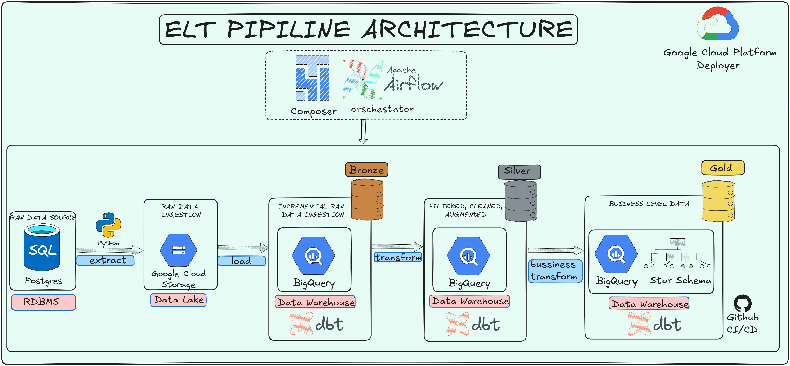

# END TO END ELT PIPELINE
## Chapter 1 -Pengenalan Proyek

Proyek ini bertujuan untuk membangun pipeline data yang andal untuk mengumpulkan, memproses, dan menyimpan data dari berbagai sumber sehingga siap digunakan untuk analisis dalam membuat dashboard ataupun untuk membuat model prediksi dan machine learning. Proyek ini mengimplementasikan modern data pipeline, end to end ELT (Extract, Load, Transform) dengan menggunakan pendekatan medalion Architecture (Bronze, Silver, dan Gold Layer) serta pemodelan dengan menggunakan star schema untuk kebutuhan analitik dan bussniness intelligence. 

Tujuan:
> Membangun pipeline data ELT yang scalable & maintainable
> Mengolah data mentah menjadi data siap analitik
> Mengimplementasikan best practice data warehouse (star schema)
> Mendukung dashboard dan analisis bisnis

## Chapter 2 - Dataset

Dataset yang digunakan dalam proyek ini merupakan data E-Commerce sintetis yang dihasilkan menggunakan library Python Faker. Dataset terdiri dari beberapa tabel utama yang merepresentasikan proses bisnis transaksi, yaitu:

> customers → data pelanggan
> orders → data transaksi
> item_orders → detail item dalam setiap transaksi
> products → data produk
> categories → kategori produk

### Kondisi Data
Data yang digunakan dalam proyek ini tidak dalam kondisi bersih (dirty data) dan secara sengaja dibuat mendekati kondisi di dunia nyata (production-like). Beberapa permasalahan yang terdapat dalam dataset antara lain:

Data duplikat
> Nilai kosong (missing values)
> Inkonsistensi format data
> Tipe data yang tidak sesuai
> Kesalahan logika bisnis
> Typo pada beberapa field
> Tujuan Penggunaan Dataset

Dataset ini dirancang untuk:
> Mensimulasikan permasalahan data di dunia nyata
> Menguji proses data cleaning dan transformation
> Mengimplementasikan praktik terbaik dalam data engineering
> Membangun pipeline yang robust dan siap produksi

Dengan kondisi data yang kompleks ini, proyek ini memberikan gambaran nyata bagaimana seorang data engineer menangani data dari tahap mentah hingga siap digunakan untuk analisis.

### contoh data set
SELECT *
FROM customers
LIMIT 10;
| customer_id | name             | gender | birth_date | city           | created_at          | updated_at          |
| ----------- | ---------------- | ------ | ---------- | -------------- | ------------------- | ------------------- |
| CUST_0001   | ALLISON HILL     | M      | 1970-05-28 | lake curtis    | 2024-10-17 03:59:57 | 2024-10-29 03:59:57 |
| CUST_0002   | Angie Henderson  | Female | 1957/10/06 | NULL           | 2024-05-30 19:19:05 | 2024-10-02 19:19:05 |
| CUST_0003   | Matthew Gardner  | Male   | 1970-03-21 | lawrencetown   | 2024-10-31 06:08:47 | 2025-01-10 06:08:47 |
| CUST_0004   | Melissa Peterson | F      | NULL       | PORT MATTHEW   | 2023-06-01 21:51:35 | 2024-05-12 21:51:35 |

## Chapter 3 - Architecture

Pipeline ini menggunakan modern airsitektur ELT yang mana raw data di ekstrak dari realtion database dan diproses melalui berbagai layer.

The system consists of the following components:

1. **Source Database**
   Sumber data yang mana data akan diekstrak dari sini

2. **Data Extraction**
   Python scripts extract data from the source database.
   Script Python akan mengekstrak data dari sumber database

3. **Data Lake**
   Semua data mentah akan di load di sini agar biaya penyimpanan raw data jauh lebih murah.

4. **Bronze Layer (Data Warehouse)**
   Raw Data akan  disimpan ke dalam warehouse BigQuery, data yang disimpan di sini adalah data yang tidak duplikat dengan menggunakan incremental load.

5. **Silver Layer (Transform Layer)**
   dengan menggunakan dbt, data kotor akan ditransform menjadi data yang bersih dari null, duplikat, dll

6. **Gold Layer (Transform Layer)**
   Data yang sudah bersih disimpan ke dalam gold layer dengan star schema yang sudah siap digunakan oleh data analyst maupun data scientist

7. **Orchestration**
   Apache airflow akan menjadwalkan dan mengatur data pipeline sesuai dengan jam yang sudah ditentukan

## Chapter 4 - 
