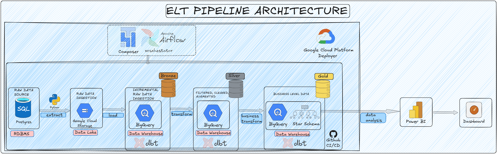

# END TO END ELT PIPELINE
## Chapter 1 -Pengenalan Proyek

Proyek ini bertujuan untuk membangun pipeline data yang andal untuk mengumpulkan, memproses, dan menyimpan data dari berbagai sumber sehingga siap digunakan untuk analisis dalam membuat dashboard ataupun untuk membuat model prediksi dan machine learning. Proyek ini mengimplementasikan modern data pipeline, end to end ELT (Extract, Load, Transform) dengan menggunakan pendekatan medalion Architecture (Bronze, Silver, dan Gold Layer) serta pemodelan dengan menggunakan star schema untuk kebutuhan analitik dan bussniness intelligence. 

Tujuan:
> Membangun pipeline data ELT yang scalable & maintainable
> Mengolah data mentah menjadi data siap analitik
> Mengimplementasikan best practice data warehouse (star schema)
> Mendukung dashboard dan analisis bisnis

## Chapter 2 - Dataset

Dataset yang digunakan dalam proyek ini merupakan data E-Commerce sintetis yang dihasilkan menggunakan library Python Faker. Dataset terdiri dari beberapa tabel utama yang merepresentasikan proses bisnis transaksi, yaitu:

> customers → data pelanggan
> orders → data transaksi
> item_orders → detail item dalam setiap transaksi
> products → data produk
> categories → kategori produk

### Kondisi Data
Data yang digunakan dalam proyek ini tidak dalam kondisi bersih (dirty data) dan secara sengaja dibuat mendekati kondisi di dunia nyata (production-like). Beberapa permasalahan yang terdapat dalam dataset antara lain:

Data duplikat
> Nilai kosong (missing values)
> Inkonsistensi format data
> Tipe data yang tidak sesuai
> Kesalahan logika bisnis
> Typo pada beberapa field
> Tujuan Penggunaan Dataset

Dataset ini dirancang untuk:
> Mensimulasikan permasalahan data di dunia nyata
> Menguji proses data cleaning dan transformation
> Mengimplementasikan praktik terbaik dalam data engineering
> Membangun pipeline yang robust dan siap produksi

Dengan kondisi data yang kompleks ini, proyek ini memberikan gambaran nyata bagaimana seorang data engineer menangani data dari tahap mentah hingga siap digunakan untuk analisis.

### contoh data set
SELECT *
FROM customers
LIMIT 10;
| customer_id | name             | gender | birth_date | city           | created_at          | updated_at          |
| ----------- | ---------------- | ------ | ---------- | -------------- | ------------------- | ------------------- |
| CUST_0001   | ALLISON HILL     | M      | 1970-05-28 | lake curtis    | 2024-10-17 03:59:57 | 2024-10-29 03:59:57 |
| CUST_0002   | Angie Henderson  | Female | 1957/10/06 | NULL           | 2024-05-30 19:19:05 | 2024-10-02 19:19:05 |
| CUST_0003   | Matthew Gardner  | Male   | 1970-03-21 | lawrencetown   | 2024-10-31 06:08:47 | 2025-01-10 06:08:47 |
| CUST_0004   | Melissa Peterson | F      | NULL       | PORT MATTHEW   | 2023-06-01 21:51:35 | 2024-05-12 21:51:35 |

## Chapter 3 - Tech Stack
| Category | Tool | Purpose |
|--------|--------|--------|
| Programming | Python | Data extraction and loading scripts |
| Data Source | PostgreSQL | Operational database used as the source system |
| Data Lake | Google Cloud Storage (GCS) | Storage for raw ingested data (Bronze layer) |
| Data Warehouse | BigQuery | Analytical warehouse for querying processed data |
| Data Transformation | dbt | SQL-based transformations, data tests, and incremental models |
| Orchestration | Apache Airflow | Scheduling, retries, backfilling, and SLA monitoring |
| Data Modeling | Star Schema | Analytical data model for fact and dimension tables |
| Data Architecture | Medallion Architecture | Layered pipeline design (Bronze → Silver → Gold) |
| Version Control | Git & GitHub | Source code management and collaboration |

## Chapter 4 - Arsitektur Data

Pipeline ini menggunakan modern airsitektur ELT yang mana raw data di ekstrak dari realtion database dan diproses melalui berbagai layer.

### 1. Extract (Data Source)
Sumber data: PostgreSQL (RDBMS)
Tools: Python
Proses: Mengambil data dari database menggunakan query

### 2. Data Lake (Raw Layer / Bronze)
Storage: Google Cloud Storage
Tipe data: Raw (belum diproses)

### 3. Data Warehouse - Bronze
Platform: BigQuery
Tools: dbt
Metode: Incremental load

### 4. Data Warehouse - Silver
Platform: BigQuery
Tools: dbt
Proses: Cleaning, Filtering, Standardisasi, Enrichment

### 5. Data Warehouse - Gold
Platform: BigQuery
Model: Star Schema
Tools: dbt



## Chapter 5 - Struktur File

```
project-root
│
├── dags/
│   └── pipeline.py           # Apache Airflow DAG definition
│
├── extract_load/
│   ├── extract.py                # Extract data from PostgreSQL
│   └── load.py                   # Load data to GCS / BigQuery
│
├── transform/                    # dbt project for transformations
│   ├── models/
|   |   |__bronze                 # RAW DATA
|   |   |
│   │   ├── silver/               # Cleaned intermediate tables
│   │   │
│   │   └── gold/                 # Analytics-ready star schema
│   │       
│   │
│   ├── macros/                   # Reusable dbt macros
│   ├── tests/                    # Data quality tests
│   ├── seeds/                    # Static seed data
│   ├── snapshots/                # Slowly changing dimension tracking
│   ├── dbt_packages/             # Installed dbt dependencies
│   ├── dbt_project.yml           # dbt project configuration
│   └── profiles.yml              # dbt connection configuration
│
├── images/                       # Documentation images
├── logs/                         # Pipeline execution logs
├── .env                          # Environment variables
├── .gitignore
├── README.md
└── venv/                         # Python virtual environment
```
## Chapter 6 - Cara Menjalanakan Pipeline

## 0. Siapkan Seluruh Data, Folder, dan File yang ada di Github
## 1. Setup Environment
    -- bash --
    > Py -3.11 -m venv venv
    > venv\Scripts\Activate

## 2. Setup DBT
    -- bash --
    > pip install dbt-core
    > pip install dbt-bigquery

## 3. Setup GCP
### a. Siapkan Bucket
> bucket digunakan untuk 

### b. Siapkan Bigquery
> siapkan schema bronze, silver dan gold serta tabelnya

### c. Siapkan Composer
> setup airflow

## 4. Setup Airflow
 ### a. Buat connection untuk postgres dan google clouds
 airflow -> admin -> connection

 ### b. upload file yang ada di local ke DAGs folder
 > file dag, file transform, dan file extarct_load

 ### c. Siapkan pypi packages
 > pandas, pyarrow, psycopg2-binary, sqlalchemy, google-clouds-storage, requests, apache-airflow-providers-google, apache-airflow-providers-postgres, dbt-core, dbt-bigquery

 ### d. buka airflow UI dan pencet trigger DAG
 > di sini proses ekstrak, load, dan transform akan berjalan


## Chapter 7 - Hasil

dataset postgres

